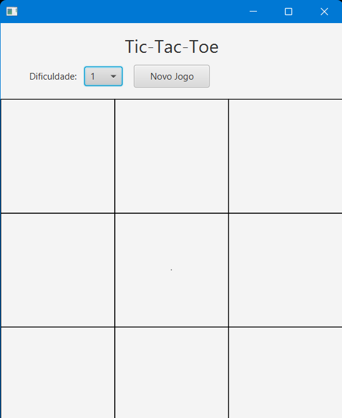
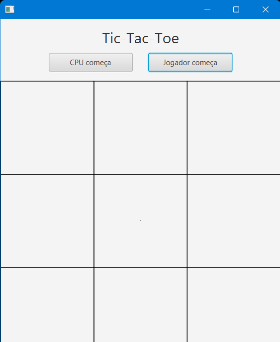
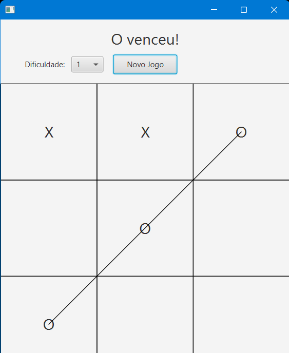
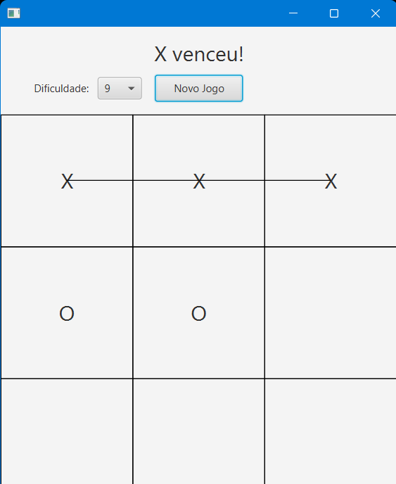
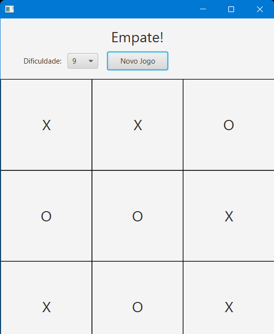

# Jogo da Velha com Minimax em JavaFX

**Aluno:** Daniel Peçanha Pereira

Este projeto implementa o Jogo da Velha (Tic-Tac-Toe) com interface gráfica desenvolvida em JavaFX. O jogo permite que o usuário jogue contra o computador, que utiliza o algoritmo **Minimax** para decidir suas jogadas de forma estratégica.

---

## Funcionamento do Jogo

Ao iniciar, o jogador pode escolher:

- **Quem começa**: Usuário (O) ou Computador (X).
- **Nível de dificuldade**: entre 1 (fácil) e 9 (difícil).

A cada jogada do usuário, o computador responde utilizando o algoritmo **Minimax** para determinar a jogada ideal.

---

## Algoritmo Minimax

A lógica do Minimax se baseia na criação de uma **árvore de possibilidades**, onde o algoritmo simula todas as jogadas possíveis até o estado final do jogo (vitória, derrota ou empate).

Cada jogada recebe um valor baseado no resultado final esperado:

- **Vitória da CPU**: `10 - profundidade`
- **Derrota da CPU**: `-10 + profundidade`
- **Empate**: `0`

Com isso, o algoritmo:

- Prefere vencer o quanto antes.
- Procura adiar ao máximo uma derrota.

A **profundidade** é passada como parâmetro recursivo, sendo incrementada a cada nível da árvore. Isso influencia diretamente a avaliação.

### Exemplo:

- `10 - 1 = 9`
- `10 - 4 = 5`
- Logo: `9 > 5`

**Explicação**:  
No primeiro caso, a profundidade era 1, no outro, 4. Como o computador quer vencer o quanto antes, ele escolhe caminhos mais curtos.  
A operação `10 - profundidade` valoriza caminhos rápidos para a vitória.

Para derrotas ou empates, o algoritmo valoriza os caminhos mais longos:

- Derrota em profundidade 2: `-10 + 2 = -8`
- Derrota em profundidade 6: `-10 + 6 = -4`

Neste caso, o valor retornado é o **maior entre os negativos**, ou seja, `-4` (pois representa uma derrota mais tardia).

---

## Sistema de Dificuldade

A dificuldade é representada por um número entre **1 e 9**, escolhido pelo jogador:

- **Dificuldade 1** → profundidade real = 1
- **Dificuldade 9** → profundidade real = 9

Internamente, a profundidade máxima usada pelo Minimax é calculada com:<br> profundidadeMaxima = 9 - (dificuldadeEscolhida - 1) 

Esse cálculo garante que "1" seja o mais fácil e "9" o mais difícil, proporcionando uma escala de dificuldade intuitiva.

---
## Tecnologias Utilizadas

* Linguagem: **Java**
* Interface gráfica: **JavaFX**
## Como Utilizar

### Pré-requisitos

* Java JDK 17 ou superior.
* JavaFX SDK configurado corretamente em seu ambiente.

### Passos para execução

1. Clone este repositório:

```bash
git clone https://github.com/Danbr23/GPON-Calculator.git
```

2. Abra o projeto na sua IDE de preferência (IntelliJ IDEA, Eclipse, NetBeans, etc.).

3. Configure as bibliotecas do JavaFX caso ainda não estejam configuradas.

4. Execute o arquivo principal `Main.java` no pacote application para iniciar a aplicação.

---

## Imagens



### Escolha de quem vai começar: Usuário ou CPU


### Vitória do usuário


### Vitoria do computador


### Empate

